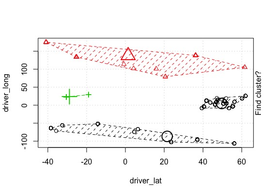

```{r setup, include=FALSE}
knitr::opts_chunk$set(echo = TRUE)
```

## Project Introduction

This report contains findings and steps-taken during Stage 2 (of 3) of a project in **MIS 545 - Data Mining for Business Intelligence**, taught by Dr. Bin Zhang at The University of Arizona.

The requirements for this stage were for team members to independently test different data subsets or algorithms, or to try different approaches altogether (as compared to Stage 1). In Stage 3, the team will regroup and build off eachother's analyses.

## Problem Description

Apart from the extreme financial demands of Formula 1, one of the great challenges of the sport is for team principals and strategists to decide which of their two drivers to prioritize in a race. Sometimes it is obvious which driver is faster (thus deserving preferential treatment) and other times it is not (which often leads to conflict). Being able to better predict race outcomes would allow for more effective team strategizing.

## Team vs Individual Approach

In Stage 1 of the project, the team set out to predict order of podium finishers (i.e. top 3) in a given race based off of individual lap data from 2011 to 2017. We incorporated C5.0, SVM, and Naieve Bayes classifer algorithms. The findings produced fair accuracies, but their usefulness was limited due to only considering outcomes of 3 drivers and only building off data from a 6 year window. Having the granularity of lap times as opposed to race results also resulted in problematic redundancies.

Given these shortfalls, for Stage 2 I chose to re-structure the dataset to include race results of all drivers dating back to 1950. The process required extensive cleaning, but ultimately allowed me to predict whether or not a racer would finish 'in the points' (i.e. top 10) or 'out of the points', which seemed like a more useful finding. Once the cleaning had been performed, I went back and incorporated an additional dataset to obtain driver home town geocordinates. In the end, the algorithms that I tested were as follows:

* **K-Means** - on where drivers are from geographicaly (values were assigned back to the dataset) 
* **Naieve Bayes** - to predict whether or not a racer finished 'in the points'

## Dataset Descriptions

Data for this project was obtained from **Kaggle** (<https://www.kaggle.com/cjgdev/formula-1-race-data-19502017>). It was originally sourced from **Ergast Developer API** (<https://ergast.com/mrd/>) at the conclusion of the 2017 season. Data on ergast is gathered and published to the public domain by Chris Newell.

The raw data is comprised of the below 13 files, where code chunks contain table dimensions and summary statistics. The 'laptimes' table is the largest file, containing over 400,000 records. Due to my decision to change the grain to race outcome per driver (as opposed to lap times per driver, per race), the 'results' file dictated the overall number of observations at just under 30,000.

```{r include=FALSE}
#### Load packages ####

library(tidyverse)
library(lubridate)
library(chron)
```


```{r include=FALSE}
#### Load files ####

# define input path
path_in <- "../Raw Source Data"

# read files
circuits <- read.csv(file.path(path_in, "circuits.csv"), stringsAsFactors = F)
constructorResults <- read.csv(file.path(path_in, "constructorResults.csv"), stringsAsFactors = F)
constructors <- read.csv(file.path(path_in, "constructors.csv"), stringsAsFactors = F)
constructorStandings <- read.csv(file.path(path_in, "constructorStandings.csv"), stringsAsFactors = F)
drivers <- read.csv(file.path(path_in, "drivers.csv"), stringsAsFactors = F)
driverStandings <- read.csv(file.path(path_in, "driverStandings.csv"), stringsAsFactors = F)
lapTimes <- read.csv(file.path(path_in, "lapTimes.csv"), stringsAsFactors = F)
pitStops <- read.csv(file.path(path_in, "pitStops.csv"), stringsAsFactors = F)
qualifying <- read.csv(file.path(path_in, "qualifying.csv"), stringsAsFactors = F, skipNul = TRUE, na.strings = c("","NULL","NA")) # also convert embedded NULLs and blanks to NA))
races <- read.csv(file.path(path_in, "races.csv"), stringsAsFactors = F, skipNul = TRUE, na.strings = c("","NULL","NA")) # also convert embedded NULLs and blanks to NA))
results <- read.csv(file.path(path_in, "results.csv"), stringsAsFactors = F, na.strings = c("","NULL","NA")) # also convert embedded NULLs and blanks to NA))
seasons <- read.csv(file.path(path_in, "seasons.csv"), stringsAsFactors = F)
status <- read.csv(file.path(path_in, "status.csv"), stringsAsFactors = F)
```


**circuits:** every circuit name, location, and wiki page url

```{r echo=FALSE}
dim(circuits)
summary(circuits)
```

**constructorResults:** aggregated constructor points earned per race
```{r echo=FALSE}
dim(constructorResults)
summary(constructorResults)
```
  + 'D' in 'status' column represents 'Disqualified' due to Spygate scandal in 2007 season (<https://en.wikipedia.org/wiki/2007_Formula_One_espionage_controversy>)
  
**constructors:** every constructor name, nationality, and wiki page url
```{r echo=FALSE}
dim(constructors)
summary(constructors)
```
  + constructors are teams (e.g. Ferrari, Williams, Red Bull, etc.)
  + in modern racing era there are 10 constructors with 2 drivers each

**constructorStandings:** running/accumulated 'points' and 'wins' for constructors in a given season
```{r echo=FALSE}
dim(constructorStandings)
summary(constructorStandings)
```

**drivers:** every driver name, number, dob, nationality, and wiki page url
```{r echo=FALSE}
dim(drivers)
summary(drivers)
```
  + create feature that contains driver age at time of race

**driverStandings:** accumulated driver points and wins for a given season
```{r echo=FALSE}
dim(driverStandings)
summary(driverStandings)
```

**lapTimes:** lap time and position for each driver in each lap of each race
```{r echo=FALSE}
dim(lapTimes)
summary(lapTimes)
```
  + file is missing lap times from at least races 400-800 (by raceID)
  + lap 25 of raceId 847 (2011 Canadian Grand Prix had "torrential rains" that caused a single lap to clock in at over 2 hrs)

**pitStops:** stop number and stop duration/milliseconds of each pitstop at a given time of day on a given lap by a given driver
```{r echo=FALSE}
dim(pitStops)
summary(pitStops)
```
  + file excludes races before 2011 and after 2017

**qualifying:** qualifying times (and final qualifying position) for each driver of each race
```{r echo=FALSE}
dim(qualifying)
summary(qualifying)
```
  + the process of qualifying determines grid position at start of race
  + the slowest drivers (e.g. bottom 5) get knocked out after each round of qualifying
  + 'position' should be the same as grid in results file

**races:** race name, date, and time for each seasons, and wiki page url
```{r echo=FALSE}
dim(races)
summary(races)
```
  + race time is empty from 1950 to 2005
  + remove 'name' which will be redundant after merge (circuits table contains ref)

**results:** results of every race (*critical file containing dependent variables*)
```{r echo=FALSE}
dim(results)
summary(results)
```
  + 'time' is inconsistently represented as minutes:seconds beyond 1 hr for first place driver, then the gap for next several drivers
  + no time is recorded for racers greater than 1 lap behind the winner
  + 'position' = raceFinish, 'positionText' = raceFinish or descriptor of retired/disqualified etc., 'positionOrder' = raceFinish or order of retired/disqualified
  + positionText: D=Disqualified, E=Excluded, F=Did Not (/failed to) Qualify, N=Not Classified, R=Retired, W=Withrew
  + fastest lap data is empty or NA from 1950 to 2004
  + 'grid' is mostly a duplicate of position in qualifying table, but is likely more reliable

**seasons:** year and wiki page url of each season
```{r echo=FALSE}
dim(seasons)
summary(seasons)
```
  + somewhat irrelevant file unless wanting to scrape wiki pages

**status:** key and description of race results (e.g. finished, +1 Lap, collision, etc.)
```{r echo=FALSE}
dim(status)
summary(status)
```


## Data Preprocessing

The preprocessing phase took place in two stages:

1. **Individual file cleaning** - For this phase I treated every file as if it could be utilized at some point (e.g. during Stage 3), despite my personal decision to exclude records for lap times, pitStops, qualifying times, etc. This is when most of the field renaming, deleting, and data type converting took place.

2. **Merged file cleaning** - After the individual files were cleaned, I merged the files through a series of left joins beginning on 'results', which contained the dependent variable(s). During this stage I continued to clean data, e.g. correcting typos, removing outliers, handling NAs, and additional feature creation, etc. I also merged latitude, longitude data for drivers' home towns.

The entire process involved several interations of exploration, cleaning, and data transformation. The specifics of what was performed is outlined in the comments of the code chunks.


### Individual File Cleaning

```{r}
# The below code was used for each and every section (where df = data frame) to inspect for completeness. It is not displayed repeatedly for space-saving purposes.

# df(df == "" | df == "NULL" | is.na(df))

```


```{r}

## circuits -----------------------------------------------------------------

# remove columns: 'name', 'alt' ('name' is dirtier and lengthier than 'circuitRef' & 'alt' appears to have no meaning)
# keep columns: 'url', 'lat', 'long' in case wanting to scrape wiki pages and/or calculate distance (e.g. from home)
circuits <- subset(circuits, select = -c(name, alt))

# clean dirty location names (caused by accent characters)
circuits[c(4,18,20), "location"] <- c("Montmelo", "Sao Paulo", "Nurburg")

# rename columns
circuits <- circuits %>%
  rename("circuit_name" = "circuitRef", "circuit_city" = "location", "circuit_country" = "country", "circuit_lat" = "lat", "circuit_long" = "lng", "circuit_url" = "url"
         )


## constructorResults -------------------------------------------------------

# 'D' in 'status' column represents 'Disqualified' due to Spygate scandal in 2007 season (https://en.wikipedia.org/wiki/2007_Formula_One_espionage_controversy)

# inspect distribution of 'status' (see above description of 'D') & remove column
table(constructorResults$status)
constructorResults <- subset(constructorResults, select = -status)

# convert 'points' to int type
constructorResults$points <- as.integer(constructorResults$points)

# rename columns
constructorResults <- constructorResults %>%
  rename("constructorResult_pointsPerRace" = "points")


## constructors -------------------------------------------------------------

# again keeping 'url' column incase of desire to scrape

# remove columns: 'name', 'X' ('X' is entirely NA values)
constructors <- subset(constructors, select = -c(X, name))

# rename columns
constructors <- constructors %>%
  rename("constructor_name" = "constructorRef", "constructor_nationality" = "nationality", "constructor_url" = "url"
         )


## constructorStandings -----------------------------------------------------

# remove column: 'positionText' ('positionText' is identical to 'position' with the exception of 'E' for excluded due to "Spygate" scandal (see constructorResults section))
# remove column: 'X' ('X' is entirely NA values)
constructorStandings <- subset(constructorStandings, select = -c(positionText, X))

# convert 'points' to int type
constructorStandings$points <- as.integer(constructorStandings$points)

# rename columns
constructorStandings <- constructorStandings %>%
  rename("constructorStanding_runningTotalPointsInSeason" = "points", "constructorStanding_runningPositionInSeason" = "position", "constructorStanding_runningTotalWinsInSeason" = "wins"
         )


## drivers ------------------------------------------------------------------

# remove column: 'number' ('number' is arbitrary driver/car number)
# remove columns: 'code' 'forename', 'surname' ('code' serves no purpose $ forename' and 'surname' are messier and lengthier than 'driverRef')
drivers <- subset(drivers, select = -c(number, code, forename, surname))

# clean dob column and convert to date type variable using lubridate function
drivers[415, "dob"] <- "12/08/1993"
drivers$dob <- dmy(drivers$dob)

# manually handle the 7 records that failed to parse and re-run lubridate
drivers[c(590, 704, 742, 751, 761, 787, 792), "dob"] <-
  c("1899-08-03", "1898-11-01", "1896-12-28", "1899-10-15", "1899-10-13", "1898-06-09", "1898-10-18")
drivers$dob <- ymd(drivers$dob)

# rename columns
drivers <- drivers %>%
  rename("driver_name" = "driverRef", "driver_dob" = "dob", "driver_nationality" = "nationality", "driver_url" = "url"
         )


## driverStandings ----------------------------------------------------------

# remove column: 'positionText' ('positionText' is identical to 'position' with the exception of 'D' for disqualification from the championship due to intentional collision)
driverStandings <- subset(driverStandings, select = -positionText)

# convert 'points' to int type
driverStandings$points <- as.integer(driverStandings$points)

# rename columns
driverStandings <- driverStandings %>%
  rename("driverStanding_runningTotalPointsInSeason" = "points", "driverStanding_runningPositionInSeason" = "position", "driverStanding_runningTotalWinsInSeason" = "wins"
         )


## lapTimes -----------------------------------------------------------------

# inspect distribution of lap times
hist(lapTimes$raceId)

# remove column: 'time' ('time' == 'milliseconds')
lapTimes <- subset(lapTimes, select = -time)

# create an average lap time column
lapTimes <- lapTimes %>%
  group_by(raceId, driverId) %>%
  mutate(lapTime_avgMillisec = as.integer(mean(milliseconds)))

# ungroup columns and convert back to data frame
lapTimes <- lapTimes %>%
  ungroup() %>%
  as.data.frame()

# rename columns
lapTimes <- lapTimes %>%
  rename("lapTime_positionInLap" = "position", "lapTime_millisec" = "milliseconds")


## pitStops -----------------------------------------------------------------

# inspect distribution of pit stops
hist(pitStops$raceId)

# remove column: 'duration' ('duration' == 'milliseconds')
pitStops <- subset(pitStops, select = -duration)

# create a total number of stops per race column
pitStops <- pitStops %>%
    group_by(raceId, driverId) %>%
    arrange(raceId, driverId, stop) %>%
    mutate(pitStop_totalStops = last(stop))

# create an average pitstop duration column
pitStops <- pitStops %>%
    group_by(raceId, driverId) %>%
    mutate(pitStop_avgDuration = as.integer(mean(milliseconds)))

# ungroup columns and convert back to data frame
pitStops <- pitStops %>%
  ungroup() %>%
  as.data.frame()

# rename columns
pitStops <- pitStops %>%
  rename("pitStop_stopNum" = "stop", "pitStop_lap" = "lap", "pitStop_timeOfDay" = "time", "pitStop_durationMillisec" = "milliseconds"
         )


## qualifying ---------------------------------------------------------------

# remove column: 'number' ('number' is arbitrary driver/car number)
qualifying <- subset(qualifying, select = -number)

# correct erroneous record in q2
qualifying[5663, "q2"] <- "1:48.552"

# convert 'q1':'q3' to milliseconds
qualifying <- qualifying %>%
  separate(q1, into = c("q1_minuteSecond", "q1_decimal"), sep = "\\.") %>%
  separate(q1_minuteSecond, into = c("q1_minute", "q1_second"), convert = TRUE) %>%
  mutate(q1_milliseconds = paste0(((q1_minute * 60) + q1_second), q1_decimal))

qualifying <- qualifying %>%
  separate(q2, into = c("q2_minuteSecond", "q2_decimal"), sep = "\\.") %>%
  separate(q2_minuteSecond, into = c("q2_minute", "q2_second"), convert = TRUE) %>%
  mutate(q2_milliseconds = paste0(((q2_minute * 60) + q2_second), q2_decimal))

qualifying <- qualifying %>%
  separate(q3, into = c("q3_minuteSecond", "q3_decimal"), sep = "\\.") %>%
  separate(q3_minuteSecond, into = c("q3_minute", "q3_second"), convert = TRUE) %>%
  mutate(q3_milliseconds = paste0(((q3_minute * 60) + q3_second), q3_decimal))

# convert 'NANA's (caused by concatenation) to NAs
qualifying[qualifying == "NANA"] <- NA

# remove columns: 'q1_minute' through 'q3_decimal' (temp columns created for parsing)
qualifying <- subset(qualifying, select = -c(q1_minute:q3_decimal))

# rename columns
qualifying <- qualifying %>%
  rename("qualifying_finishPosition" = "position", "qualifying_q1Millisec" = "q1_milliseconds", "qualifying_q2Millisec" = "q2_milliseconds", "qualifying_q3Millisec" = "q3_milliseconds"
         )


## races --------------------------------------------------------------------

# convert 'date' to date type
races$date <- ymd(races$date)

# convert 'time' to time type
races$time <- times(races$time)

# rename columns
races <- races %>%
  rename("race_year" = "year", "race_round" = "round", "race_name" = "name", "race_date" = "date", "race_time" = "time", "race_url" = "url"
         )


## results ------------------------------------------------------------------

# remove columns: 'position', 'number', 'time', 'fastestLap', 'rank', 'fastestLapTime', 'fastestLapSpeed'
# ('position' is redundant, 'number' is arbitrary driver/car number, 'time' is represented more cleanly in 'milliseconds')
results <- subset(results, select = -c(position, number, time))

# convert positionText column to finish description
results <- mutate(results, result_finishDescription = 
                  ifelse(results$positionText == "D", "Disqualified",
                  ifelse(results$positionText == "E", "Excluded",
                  ifelse(results$positionText == "F", "FailedToFinish",
                  ifelse(results$positionText == "N", "NotClassified",
                  ifelse(results$positionText == "R", "Retired",
                  ifelse(results$positionText == "W", "Withdrew",
                  "Finished"
                  )))))))
results <- subset(results, select = -positionText)

# convert fastestLapTime to milliseconds
results <- results %>%
  separate(fastestLapTime, into = c("fLT_minuteSecond", "fLT_decimal"), sep = "\\.") %>%
  separate(fLT_minuteSecond, into = c("fLT_minute", "fLT_second"), convert = TRUE) %>%
  mutate(fLT_milliseconds = paste0(((fLT_minute * 60) + fLT_second), fLT_decimal, "00"))

# convert 'NANA00's (caused by concatenation) to NAs
results$fLT_milliseconds[results$fLT_milliseconds == "NANA00"] <- NA

# convert 'points', 'fastestLapSpeed', and 'fLT_milliseconds' to appropriate number types
results$points <- as.integer(results$points)
results$fLT_milliseconds <- as.integer(results$fLT_milliseconds)
results$fastestLapSpeed <- as.double(results$fastestLapSpeed)

# remove columns: 'q1_minute' through 'q3_decimal' (temp columns created for parsing)
results <- subset(results, select = -c(fLT_minute:fLT_decimal))

# rename columns
results <- results %>%
  rename("result_startingGridPosition" = "grid", "result_finishOrder" = "positionOrder", "result_pointsEarned" = "points", "result_lapsCompleted" = "laps", "result_finishTimeMillisec" = "milliseconds", "result_fastestLapTimeMillisec" = "fLT_milliseconds", "result_fastestLap" = "fastestLap", "result_fastestLapRank" = "rank", "result_fastestLapSpeed" = "fastestLapSpeed"
         )


## seasons ------------------------------------------------------------------

# convert year to date type
seasons$year <- as.character(seasons$year)
seasons$year <- as.Date(paste(seasons$year, 1, 1, sep = "-")) # beginning of year
seasons$year <- as.Date(paste(seasons$year, 12, 31, sep = "-")) # end of year

# rename columns
seasons <- seasons %>%
  rename("season_year" = "year", "season_url" = "url")


## status ------------------------------------------------------------------

# rename column
colnames(status) [colnames(status) == "status"] <- "status_description"
```

```{r include=FALSE}
#### Write files ####

# define output path
path_out1 <- "../Processed Data"

# write to csvs
write.csv(circuits, file.path(path_out1, "circuits_clean.csv"), row.names = F)
write.csv(constructorResults, file.path(path_out1, "constructorResults_clean.csv"), row.names = F)
write.csv(constructors, file.path(path_out1, "constructors_clean.csv"), row.names = F)
write.csv(constructorStandings, file.path(path_out1, "constructorStandings_clean.csv"), row.names = F)
write.csv(drivers, file.path(path_out1, "drivers_clean.csv"), row.names = F)
write.csv(driverStandings, file.path(path_out1, "driverStandings_clean.csv"), row.names = F)
write.csv(lapTimes, file.path(path_out1, "lapTimes_clean.csv"), row.names = F)
write.csv(pitStops, file.path(path_out1, "pitStops_clean.csv"), row.names = F)
write.csv(qualifying, file.path(path_out1, "qualifying_clean.csv"), row.names = F)
write.csv(races, file.path(path_out1, "races_clean.csv"), row.names = F)
write.csv(results, file.path(path_out1, "results_clean.csv"), row.names = F)
write.csv(seasons, file.path(path_out1, "seasons_clean.csv"), row.names = F)
write.csv(status, file.path(path_out1, "status_clean.csv"), row.names = F)
```


### Merge and Additional Cleaning

```{r}
# read in country Codes
countryCodes <- read.csv("../Raw Source Data/countryCodes.csv", stringsAsFactors = FALSE)

# manually correct errors caused by accent marks
countryCodes[1214, 1] <- "Monegasque"

# join countryCodes to drivers and constructors to convert nationality to country
drivers <- drivers %>%
  left_join(countryCodes, by = c("driver_nationality" = "Nationality")) %>%
  select(-driver_nationality) %>%
  rename("driver_homeCountry" = "Country")

constructors <- constructors %>%
  left_join(countryCodes, by = c("constructor_nationality" = "Nationality")) %>%
  select(-constructor_nationality) %>%
  rename("constructor_homeCountry" = "Country")

# manually correct errors cause by compound nationalities (e.g. 'East German') or similar causes
drivers[496, 5] <- "Italy"
drivers[578, 5] <- "Italy"
drivers[714, 5] <- "Germany"
drivers[715, 5] <- "Germany"
drivers[718, 5] <- "Germany"

constructors[100, 4] <- "Belgium"
constructors[146, 4] <- "Germany"

# join countriesLatLong to drivers to obtain lat, long coordinates
# source: https://github.com/knowitall/chunkedextractor/blob/master/src/main/resources/edu/knowitall/chunkedextractor/demonyms.csv
countriesLatLong <- read.csv("../Raw Source Data/countries_LatLong.csv", stringsAsFactors = FALSE)

drivers <- drivers %>%
  left_join(countriesLatLong, by = c("driver_homeCountry" = "name")) %>%
  rename("driver_lat" = "latitude", "driver_long" = "longitude")

# clean missing lat, long for "Rhodesia"
# arrange rows by driver_homeCountry
drivers <- drivers %>%
  arrange(driver_homeCountry)

# manually update missing lat, longs
drivers[445:448, 6] <- -19.0154381
drivers[445:448, 7] <- 29.1548576

# join countriesLatLong to constructors to obtain lat, long coordinates
# source: https://github.com/knowitall/chunkedextractor/blob/master/src/main/resources/edu/knowitall/chunkedextractor/demonyms.csv
constructors <- constructors %>%
  left_join(countriesLatLong, by = c("constructor_homeCountry" = "name")) %>%
  rename("constructor_lat" = "latitude", "constructor_long" = "longitude")

# manually update missing lat, longs
constructors[93, 5] <- -19.0154381
constructors[93, 6] <- 29.1548576

# join source tables beginning from 'results' in reverse alphabetical order
# confirm primary key
results %>%
  count(resultId) %>%
  filter(n > 1)

# join status
resultsHistorical <- results %>%
  left_join(status, by = "statusId") %>%
  select(-statusId)

# exclude seasons

# join races
resultsHistorical <- resultsHistorical %>%
  left_join(races, by = "raceId") %>%
  select(-race_name, -race_year, -race_time, -race_url)

# exclude qualifying

# exclude pitStops

# exclude lapTimes

# join driverStandings
# confirm primary key
driverStandings %>%
  count(raceId, driverId) %>%
  filter(n > 1)
  
resultsHistorical <- resultsHistorical %>%
  left_join(driverStandings, by = c("raceId", "driverId")) %>%
  select(-driverStandingsId)

# join drivers
resultsHistorical <- resultsHistorical %>%
  left_join(drivers, by = "driverId") %>%
  select(-driverId, -driver_url)

# join constructorStandings
# confirm primary key
constructorStandings %>%
  count(raceId, constructorId) %>%
  filter(n > 1)

resultsHistorical <- resultsHistorical %>%
  left_join(constructorStandings, by = c("raceId", "constructorId")) %>%
  select(-constructorStandingsId)

# join constructors
resultsHistorical <- resultsHistorical %>%
  left_join(constructors, by = "constructorId") %>%
  select(-constructor_url)

# join constructorResults
# confirm primary key
constructorResults %>%
  count(raceId, constructorId) %>%
  filter(n > 1)

# remove duplicate records
constructorResults <- constructorResults[-c(9632, 10355),]

resultsHistorical <- resultsHistorical %>%
  left_join(constructorResults, by = c("raceId", "constructorId")) %>%
  select(-constructorResultsId, -constructorId)

# join circuits
resultsHistorical <- resultsHistorical %>%
  left_join(circuits, by = "circuitId") %>%
  select(-circuitId, -circuit_url, -circuit_lat, -circuit_long)


#### Clean Newly Merged Data Frame ####

# inspect df (below 4 lines commented out for space-saving purposes)
# glimpse(resultsHistorical)
# summary(resultsHistorical)
# colSums(is.na(resultsHistorical))
# head(resultsHistorical)

#normalize laps completed field
resultsHistorical <- resultsHistorical %>%
  group_by(raceId) %>%
  mutate(maxLaps = max(result_lapsCompleted),
         result_percentOfRaceCompleted = (result_lapsCompleted / maxLaps) * 100,
         result_lapsCompleted = NULL,
         maxLaps = NULL
         )

# ungroup columns
resultsHistorical <- resultsHistorical %>%
  ungroup() %>%
  as.data.frame()

# remove resultId column which is no longer needed
resultsHistorical <- subset(resultsHistorical, select = -resultId)

# remove result_finishTimeMillisec due to difficult to handle NAs
resultsHistorical <- subset(resultsHistorical, select = -result_finishTimeMillisec)

# remove columns relating to fastest lap data which contain many untreatable NAs
resultsHistorical <- subset(resultsHistorical, select = -c(result_fastestLap:result_fastestLapSpeed, result_fastestLapTimeMillisec))

# fill NAs in 'points' & 'wins' related columns with 0 and remove 'position' related columns
  # NAs in 'driverStandings.' and 'consturctorStandings.' caused by failures to qualify in early season races
  # attempt later -- [fill NAs in 'position' columns with *max runningPositionsInSeason + 1* for each season]
    # use grouped mutate (window function)
resultsHistorical$driverStanding_runningTotalPointsInSeason[is.na(resultsHistorical$driverStanding_runningTotalPointsInSeason)] <- 0

resultsHistorical$driverStanding_runningTotalWinsInSeason[is.na(resultsHistorical$driverStanding_runningTotalWinsInSeason)] <- 0

resultsHistorical <- subset(resultsHistorical, select = -driverStanding_runningPositionInSeason)

resultsHistorical$constructorStanding_runningTotalPointsInSeason[is.na(resultsHistorical$constructorStanding_runningTotalPointsInSeason)] <- 0

resultsHistorical$constructorStanding_runningTotalWinsInSeason[is.na(resultsHistorical$constructorStanding_runningTotalWinsInSeason)] <- 0

resultsHistorical$constructorResult_pointsPerRace[is.na(resultsHistorical$constructorResult_pointsPerRace)] <- 0

resultsHistorical <- subset(resultsHistorical, select = -constructorStanding_runningPositionInSeason)

# create driver age at time of race feature and convert to int
# remove 'driver_dob' (consider re-adding in future to analyze race results on closeness to birthday)
resultsHistorical <- resultsHistorical %>%
  mutate(driverAge = (race_date - driver_dob) / 365,
         driver_dob = NULL
         )

resultsHistorical$driverAge <- as.integer(resultsHistorical$driverAge)

# correct outlier
resultsHistorical[17012, "driverAge"] = 33


# convert race date to month and year columns (for better factorization)
# remove 'race_date'
resultsHistorical <- resultsHistorical %>%
  mutate(race_month = month(race_date),
         race_year = year(race_date),
         race_date = NULL
         )

# create running total points going into race for driver and constructor and remove existing columns
resultsHistorical <- resultsHistorical %>%
  mutate(driver_preRaceTotPoints = driverStanding_runningTotalPointsInSeason - result_pointsEarned,
         constructor_preRaceTotPoints = constructorStanding_runningTotalPointsInSeason - constructorResult_pointsPerRace,
         )

# correct for inaccurate observations (i.e. negative points) caused by NAs from disqualification, failure to qualify, etc.
# 1 error in driverPoints
resultsHistorical$driver_preRaceTotPoints <- ifelse(resultsHistorical$driver_preRaceTotPoints < 0, 0, resultsHistorical$driver_preRaceTotPoints)

# ~50 errors in constructor points
resultsHistorical$constructor_preRaceTotPoints <- ifelse(resultsHistorical$constructor_preRaceTotPoints < 0, 0, resultsHistorical$constructor_preRaceTotPoints)

# remove unnecessary columns
resultsHistorical <- subset(resultsHistorical, select = -c(driverStanding_runningTotalPointsInSeason, constructorStanding_runningTotalPointsInSeason))

# create running total wins going into race for driver and constructor and remove existing columns
resultsHistorical <- resultsHistorical %>%
  mutate(driver_preRaceTotWins = ifelse(result_finishOrder == 1, driverStanding_runningTotalWinsInSeason - 1, driverStanding_runningTotalWinsInSeason),
         driverStanding_runningTotalWinsInSeason = NULL
         )

resultsHistorical <- resultsHistorical %>%
  group_by(raceId, constructor_name) %>%
  mutate(constructor_preRaceTotWins = ifelse(min(result_finishOrder) == 1, constructorStanding_runningTotalWinsInSeason - 1, constructorStanding_runningTotalWinsInSeason),
         constructorStanding_runningTotalWinsInSeason = NULL
         )

# ungroup columns
resultsHistorical <- resultsHistorical %>%
  ungroup() %>%
  as.data.frame()

# correct for inaccurate observations (i.e. negative points) caused by NAs from disqualification, failure to qualify, etc.
# >200 in constructorTotWins
resultsHistorical$constructor_preRaceTotWins <- ifelse(resultsHistorical$constructor_preRaceTotWins < 0, 0, resultsHistorical$constructor_preRaceTotWins)

# remove unnecessary columns
resultsHistorical <- subset(resultsHistorical, select = -c(raceId, constructorResult_pointsPerRace))

# create features which contain previous race results and remove current race result fields
resultsHistorical <- resultsHistorical %>%
  arrange(driver_name, race_year, race_round) %>%
  mutate(result_percentOfPreviousRaceCompleted = ifelse(driver_name == lag(driver_name) & !is.na(lag(driver_name)), lag(result_percentOfRaceCompleted), 0),
         result_previousFinishDescrip = ifelse(driver_name == lag(driver_name) & !is.na(lag(driver_name)), lag(result_finishDescription), "First race"),
         status_previousDescrip = ifelse(driver_name == lag(driver_name) & !is.na(lag(driver_name)), lag(status_description), "First race"),
         result_percentOfRaceCompleted = NULL,
         result_finishDescription = NULL,
         status_description = NULL
         )

# convert columns (driverAge, percentOfPreviousRaceCompleted, preRaceTotPoints, preRaceTotWins) to integers
resultsHistorical$driverAge <- as.integer(resultsHistorical$driverAge)
resultsHistorical$result_percentOfPreviousRaceCompleted <- as.integer(resultsHistorical$result_percentOfPreviousRaceCompleted)
resultsHistorical$driver_preRaceTotPoints <- as.integer(resultsHistorical$driver_preRaceTotPoints)
resultsHistorical$driver_preRaceTotWins <- as.integer(resultsHistorical$driver_preRaceTotWins)

# convert pointsEarned to boolean
resultsHistorical <- resultsHistorical %>%
  mutate(result_inThePoints = ifelse(result_pointsEarned > 0, TRUE, FALSE),
         result_pointsEarned = NULL
  )

# arrange rows
resultsHistorical <- resultsHistorical %>%
  arrange(race_year, race_round, result_finishOrder, result_startingGridPosition)

# arrange columns
resultsHistorical <- resultsHistorical[, c("result_finishOrder", "result_inThePoints", "result_startingGridPosition", "driver_name", "constructor_name", "circuit_name", "circuit_city", "race_month", "race_year", "race_round", "driverAge", "driver_homeCountry", "driver_lat", "driver_long", "constructor_homeCountry", "constructor_lat", "constructor_long", "result_percentOfPreviousRaceCompleted", "result_previousFinishDescrip", "status_previousDescrip", "driver_preRaceTotPoints", "constructor_preRaceTotPoints", "driver_preRaceTotWins", "constructor_preRaceTotWins")]

# remove columns due to appeared unreliability
resultsHistorical <- subset(resultsHistorical, select = -c(constructor_preRaceTotPoints, constructor_preRaceTotWins))
```

```{r include=FALSE}
#### Write file ####

# define output path
path_out2 <- "../Analyzed Data"

# write to csv
write.csv(resultsHistorical, file.path(path_out2, "resultsHistorical.csv"), row.names = F)
```


## Algorithms & Execution

### K-Means

Once the data had been cleaned and consolidated, I wanted to check for hidden patterns in the dataset via clustering. I chose to test K-Means on driver home country (lat, long) because the sport is widely recognized to be biased towards European drivers and races. Could it be that drivers from a particular region are actually that much better?

The process of determining the correct number of clusters (k) involved plotting an elbow curve to measure levels of distortion. On several passes however, the kmeans.ani() function failed to identify the provided number of clusters. It seemed most consistent (as well as most logical visually) at 4 clusters.

### Naieve Bayes

After running K-Means, I first assigned the results back to the dataset and proceeded to test Naieve Bayes, assigning the dependent variable as the binarized 'result_inThePoints' feature. I kept most of the columns to use as predictors with the exception of lat, long fields which were now represented categorically in the results of the clutering. I also removed 'driver_finishOrder' which had been retained as an alternate dependent variable (factor with ~ 25 levels).

The decision to perform Naieve Bayes over other algorithms like Random Forest or Support Vector Machine was somewhat through process of elimination. For example, Random Forest can not handle factors of over ~50 levels, which would've meant more cleaning (e.g. # of circuits is over 70). Meanwhile, SVM did not appeal due its known slow processing speed. On first attempt with Naieve Bayes, I obtained very reasonable results so I did not continue to explore other classifiers.

Once the model was tested and confirmed improvement over baseline, I decided to test it on results from a race that took place just last weekend, the 2019 Brazilian Grand Prix. This required translating results data (via Ergast Developer API) into the appropriate format required for the model.

```{r include=FALSE}
#### Load packages ####

library(dplyr)
library(VIM)
library(ggplot2)
library(animation)
library(randomForest)
library(e1071)
library(corrplot)
```

```{r include=FALSE}
#### Load dataset ####
resultsHistorical <- read.csv("../Analyzed Data/resultsHistorical.csv")
```

```{r}
#### Explore data ####

# confirm no missing values
aggr(drivers)


## K-means -----------------------------------------------------------------

# incorporate lat long of driver homes to get clusters of where they come from
# then use cluster association as new feature for prediction

# partition the data
driversLatLong <- drivers[,c(2, 6:7)]

# convert driver name to factor
driversLatLong$driver_name <- as.factor(driversLatLong$driver_name)

# set seed for randmozing data
set.seed(20)

# run k-means
clusters <- kmeans(driversLatLong[,c(2:3)], 4)

# inspect cluters
str(clusters)

# plot clusters (attempt multiple times if necessary)
num_clusters <- 4

# driverClust <- kmeans.ani(driversLatLong[,c(2:3)], num_clusters)
# above line commented out for report compilation purposes
```



```{r}
# save the cluster number in the dataset as column 'driverHomeCluster'
driversLatLong <- driversLatLong %>%
  mutate(driverCluster = as.factor(clusters$cluster))

# create a function that returns the value of totwithinss, and takes inputdataset and number of clusters
# credit: Dr. Binh Zhang, The University of Arizona
kmeans.totwithinss.k <- function(dataset, number_of_centers){
  km <- kmeans(dataset, number_of_centers)
  km$tot.withinss
  }

# create a function that returns a series of totwithinss values, and takes input maxk
# vec is a vector that contains totwithinss values associated with k from 1 to maxk
# credit: Dr. Binh Zhang, The University of Arizona
kmeans.distortion <- function(dataset, maxk){
  vec <- as.vector(1:maxk)
  vec[1:maxk] <- sapply(1:maxk, kmeans.totwithinss.k, dataset = dataset)
  return (vec)
  }

# plot elbow curve
maxk <- 10

dist_vect <- kmeans.distortion(driversLatLong[,c(2:3)], maxk)

plot(1:maxk, # horizontal axis
     dist_vect, # vertical axis
     type= 'b', # curve
     col = 'blue',
     xlab = "Number of cluster",
     ylab = "Distortion"
     )

# reintroduce cluster results to resultsHistorical
driversLatLong <- subset(driversLatLong, select = -c(driver_lat, driver_long))

resultsHistorical <- resultsHistorical %>%
  left_join(driversLatLong, by = "driver_name")


#### Predict ####

## Naieve Bayes ------------------------------------------------------------

# review the data (below 2 lines commented out for space-saving purposes)
# summary(resultsHistorical)
# glimpse(resultsHistorical)

# clean dataset
resultsNB <- subset(resultsHistorical, select = -c(
  result_finishOrder,driver_lat, driver_long, constructor_lat, constructor_long)
  )

# partition data for training and testing
sample_size <- floor(0.7 * nrow(resultsNB))

training_index <- sample(nrow(resultsNB), size = sample_size, replace = FALSE)
train <- resultsNB[training_index,]
test <- resultsNB[-training_index,]

# check dimensions of partitions
dim(train)
dim(test)

# fit model
results.model <- naiveBayes(result_inThePoints ~ . , data = train)

# review model (below line commented out for space-saving purposes)
# results.model

# test model
results.predict <- predict(results.model, test, type = 'class')

# test model against recent Brazil Grand Prix results
testBrazil <- read.csv("../Processed Data/brazil2019.csv")

# factorize driverCluster dimension
testBrazil$driverCluster <- as.factor(testBrazil$driverCluster)

results.predict2 <- predict(results.model, testBrazil, type = 'class')

resultsNB_output2 <- data.frame(driver_name = testBrazil[,'driver_name'], predicted = results.predict2, actual = testBrazil[,'result_inThePoints'])

```


## Results

### K-Means

Unfortunately the results from K-Means were somewhat underwhelming. In essence, all that happened is that drivers were clustered according to continents. Obviously this data could have been easily supplemented without the use of an advanced algorithm. Nvertheless, it was still interesting to view the distribution on an animated plot chart.

### Naieve Bayes

Results from Naieve Bayes were more interesting and encouraging. The model acheived an accuracy of 77.97%, which is an improvement of 6.28% from baseline. The specificity rate was also quite impressive at 86.62%, however it is somewhat understandable given that racers in the early years of F1 would often compete in qualifying and then not actually race (thus resulting in a high FALSE rate, ie. 'Not in the points').

Results when tested against the 2019 Brazilian Grand Prix outcomes were very encouraging, producing an accuracy of 65% (a 15% improvement over baseline). The reason the baseline is higher in this scenario is because now it is always the case that 10 out of 20 drivers finish in the points (i.e. 50% conditional probability). Whereas in the past, points were allocated differently and the number of drivers in the field varied.

Additional evaluation metrics are listed below in the code chunk.

```{r}
#### Analyze results ####

# inspect correlation of variables, which could impact model (i.e. assumed independence)
train %>%
  filter(result_inThePoints == TRUE) %>%
  select_if(is.numeric) %>%
  cor() %>%
  corrplot::corrplot()

# create confusion matrix
resultsNB_output <- data.frame(actual = test[,'result_inThePoints'], predicted = results.predict)

table(resultsNB_output)

# assign 'True Positive', 'False Positive', 'True Negative', 'False Negative'
TP <- 1161
FP <- 715
TN <- 4629
FN <- 921

# calculate evaluation metrics
errorRate <- (FP + FN) / (TP + FP + TN + FN)
accuracy <- (TP + TN) / (TP + FP + TN + FN)
sensitivity <- TP / (TP + FN)
specificity <- TN / (TN + FP)
precision <- TP / (TP + FP)
falsePositiveRate <- FP / (TN + FP)


## Overall Results -------------------------------------------------------


# error rate = .2203
# model accuracy = .7797
  # baseline accuracy = .7169
  # accuracy improvement = .0628
# sensitivity (true positive) = .5576
# specificity (true negative) = .8662
# precision = .6189
# false positive rate = .1338


# results of 2019 Brazilian Grand Prix predictions
table(resultsNB_output2[,c(2,3)])

# accuracy = .65
# baseline accuracy = .5

resultsNB_output2
```

```{r include=FALSE}
#### Write File ####

# define output path
path_out2 <- "../Analyzed Data"

# write to csv
write.csv(resultsNB, file.path(path_out2, "resultsNB.csv"), row.names = F)
```


## Conclusion/reflection

Results from this analysis will undoubtedly help the team going forward. If nothing else, the dataset is now much more robust and easier to work with. It will provide a good platform for testing more advanced deep learning algorithms that may require more structured data.

Apart from this advancement, I was very pleased at how well the model performed when tested against auxillary data (i.e. 2019 Grand Prix results). Being able to succesfully predict with 65% accuracy whether or not a driver will finish better than 10 out of 20 is not bad! It is especially impressive considering the model actually chose more than 10 drivers to finish in the points which is no longer relevant. Perhaps the next improvement can be to limit the model to predict only a certain number of 'points finishers' depending on the race season in question.

Regardless, I really enjoyed this project and look forward to testing the model on the race next weekend in Abu Dhabi!